## 1. 定位

- 无人车定位的精度范围需要限制在10厘米以内，但是GPS的定位精度误差在10—50米范围不等，所以仅仅依靠GPS是不够的，还需要使用传感器和全球高精度地图进行定位。把观察的参照物和高精度地图比照，如果配对成功，把自己的坐标系转换为全球高精度坐标系，确定自己的位置。

- 一维世界的定位模型

  > 假设现实世界有三扇门，刚开始时机器人在任何地点的概率是相等的，通过第一次观察到门，三个有门的地方的概率提升（有门的地方乘以大的数，没有门的地方乘以小的数，计算完成后再归一化处理，使得概率和为1，其实就是贝叶斯运算），机器人向前再走一步，由于机器人移动的距离可能并不是很准确，所以需要对概率模型进行卷积运算（全概率），然后再次观察，发现有门，则第二个门的概率又提升。所以定位到第二个门的位置。
  >
  > **总结：首先要有一个概率分布，机器人观察物体更新概率分布，移动物体对概率分布进行滤波处理**

  

  > 下边展示的是上述观察更新用到的贝叶斯公式：
  >
  > p(x)表示先验概率，p(z|x)表示测量后得到的的值，例如：观察到红色乘以0.6观察到绿色乘以0.2

  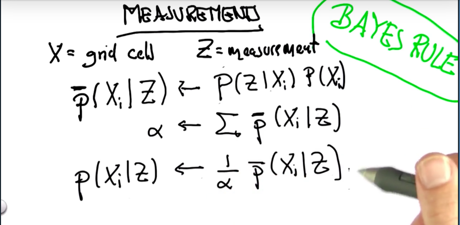

  > 如下展示的是上述运动更新概率分布时用到的全概率公式：

  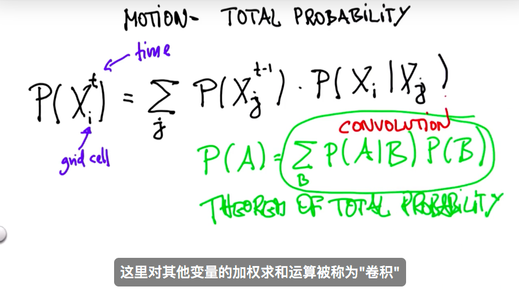

  代码展示：

  ```python
  #Given the list motions=[1,1] which means the robot 
  #moves right and then right again, compute the posterior 
  #distribution if the robot first senses red, then moves 
  #right one, then senses green, then moves right again, 
  #starting with a uniform prior distribution.

  p=[0.2, 0.2, 0.2, 0.2, 0.2]
  world=['green', 'red', 'red', 'green', 'green']
  measurements = ['red', 'green']
  motions = [1,1]
  pHit = 0.6
  pMiss = 0.2
  pExact = 0.8
  pOvershoot = 0.1
  pUndershoot = 0.1

  def sense(p, Z):
      """
      对机器人人所在的环境进行感知，根据观察到的值，更新概率分布
      """
      q=[]
      for i in range(len(p)):
          hit = (Z == world[i])
          q.append(p[i] * (hit * pHit + (1-hit) * pMiss))
      s = sum(q)
      for i in range(len(q)):
          q[i] = q[i] / s
      return q

  def move(p, U):
      """
      移动机器人时使用全概率公式更新概率分布
      """
      q = []
      for i in range(len(p)):
          s = pExact * p[(i-U) % len(p)]
          s = s + pOvershoot * p[(i-U-1) % len(p)]
          s = s + pUndershoot * p[(i-U+1) % len(p)]
          q.append(s)
      return q

  for i in range(2):
      p = sense(p, measurements[i])
      p = move(p, motions[i])

  print p  
  ```


## 2. 马尔可夫定位

- 使用普通的贝叶斯定位，六个小时积累的数据量

  > 如果使用普通的贝叶斯概率模型，数据量太大

  

- 我们必须解决两个问题

  1. 每一次的测量更新都需要从大量的数据进行计算，这对于实时定位是行不通的。
  2. 数据量是随时间递增的，会越来越大。

- 使用贝叶斯定位滤波或马尔可夫定位可以解决如上的问题

  > 当前的信仰bel(xt)可以通过前一个的信仰bel(xt-1)来表达，然后使用新的观察数据去更新当前的信仰。这样递归的进行。要实现这个需要用到：
  >
  > 1. 贝叶斯概率，
  > 2. 全概率
  > 3. 马尔可夫假设。

  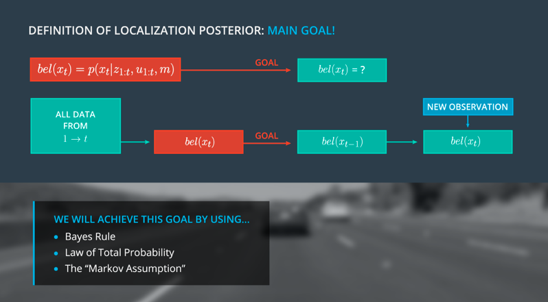

  需要预测的后验概率，注意：这个地方把z1:t写成了最z1,zt-1：

  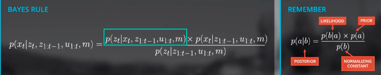

  注意到去掉后面的相似部分，其实就是常用的贝叶斯公式：

  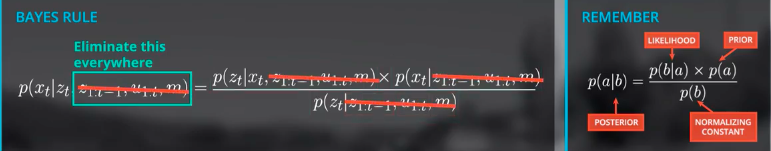

  为了简化模型，把归一化项记为η:

  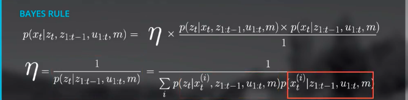

  计算先验概率p(xt|z1:t-1, u1, m)，运动模型，和sebastian所讲的卷积是一样的，使用全概率公式（连续的使用积分，不连续使用累加和）：

  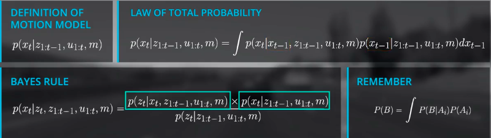

  根据如上公式，使用图表示这种关系:

  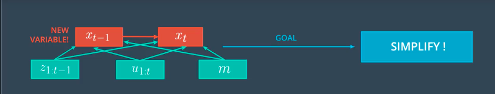

  马尔可夫假设：

  1. 因为我们已经知道xt-1状态，过去的观察z1:t-1和u1:t-1将不会提供更多的信息去预测xt，假设当前状态xt只和上一个状态xt-1相关，从而实现了递归的结构，所以p(xt|xt-1，z1:t-1, u1:t, m)可以简化为p(xt|xt-1, zt, ut,  m)。
  2. 因为预测xt-1的时候，还不知道ut，所以p(xt-1|z1:t-1, u1:t, m)可以简化为p(xt-1|z1:t-1, u1:t-1, m)。

  简化后的模型图：

  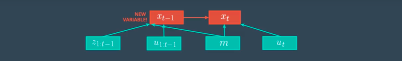

  递归结构：

  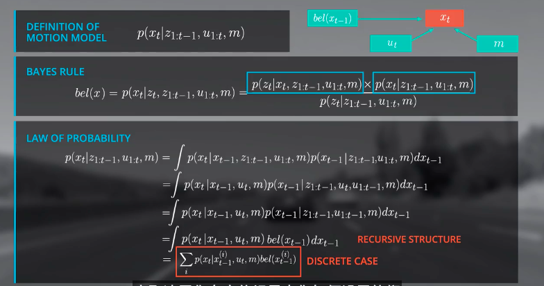

  一些细节：

  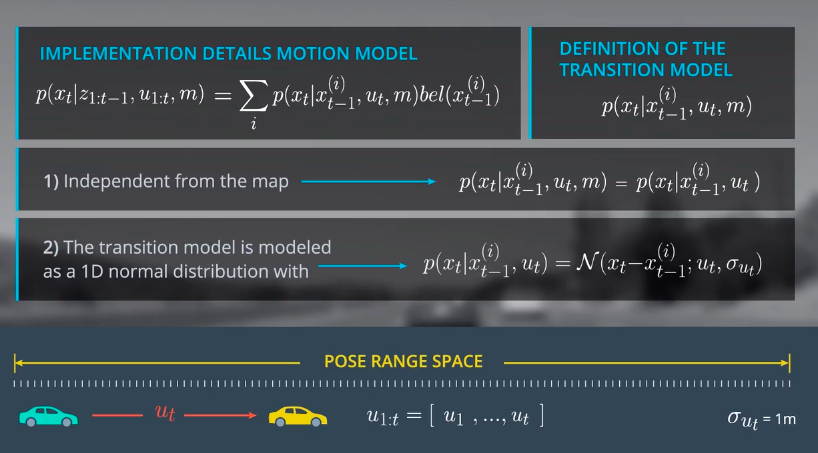

- normalized probability density function (PDF)

  ```c++
  #ifndef HELP_FUNCTIONS_H_
  #define HELP_FUNCTIONS_H_

  #include <math.h>
  #include <iostream>
  #include <vector>

  using namespace std;

  class Helpers {
  public:
  	constexpr static float STATIC_ONE_OVER_SQRT_2PI = 1/sqrt(2*M_PI) ;
  	float ONE_OVER_SQRT_2PI = 1/sqrt(2*M_PI) ;
  	static float normpdf(float x, float mu, float std) {
  	    return (STATIC_ONE_OVER_SQRT_2PI/std)*exp(-0.5*pow((x-mu)/std,2));
  	}
  };

  #endif /* HELP_FUNCTIONS_H_ */
  ```

- 运动模型，也是预测模型（根据上一步xt-1每一个位置的先验值和高斯分布，通过卷积运算，计算下一步xt每一个位置状态值，其实和之前sebastian讲的卷积运算是一样的）

  ```c++
  #include <iostream>
  #include <algorithm>
  #include <vector>

  #include "helpers.h"
  using namespace std;

  std::vector<float> initialize_priors(int map_size, std::vector<float> landmark_positions, float position_stdev);

  float motion_model(float pseudo_position, float movement, std::vector<float> priors,
                     int map_size, int control_stdev);

  int main() {
      
      //set standard deviation of control:
      float control_stdev = 1.0f;
      
      //set standard deviation of position:
      float position_stdev = 1.0f;

      //meters vehicle moves per time step
      float movement_per_timestep = 1.0f;

      //number of x positions on map
      int map_size = 25;

      //initialize landmarks
      std::vector<float> landmark_positions {5, 10, 20};
      
      // initialize priors
      std::vector<float> priors = initialize_priors(map_size, landmark_positions,
                                                    position_stdev);
      
      //step through each pseudo position x (i)    
      for (unsigned int i = 0; i < map_size; ++i) {
          float pseudo_position = float(i);

          //get the motion model probability for each x position
          float motion_prob = motion_model(pseudo_position, movement_per_timestep,
                              priors, map_size, control_stdev);
          
          //print to stdout
          std::cout << pseudo_position << "\t" << motion_prob << endl;
      }    

      return 0;
  };

  //TODO, implement the motion model: calculates prob of being at an estimated position at time t
  float motion_model(float pseudo_position, float movement, std::vector<float> priors,
                     int map_size, int control_stdev) {

      //initialize probability
      float position_prob = 0.0f;
      
      for (int i=0;i<map_size;i++){
          float next_position = float(i);
          float distance = pseudo_position-next_position;
          float transition_prob = Helpers::normpdf(distance,movement,control_stdev);
          position_prob += transition_prob * priors[i];
           
      }
      return position_prob;
  }

  //initialize priors assumimg vehicle at landmark +/- 1.0 meters position stdev
  std::vector<float> initialize_priors(int map_size, std::vector<float> landmark_positions,
                                       float position_stdev) {
  //initialize priors assumimg vehicle at landmark +/- 1.0 meters position stdev

      //set all priors to 0.0
      std::vector<float> priors(map_size, 0.0);

      //set each landmark positon +/1 to 1.0/9.0 (9 possible postions)
      float normalization_term = landmark_positions.size() * (position_stdev * 2 + 1);
      for (unsigned int i = 0; i < landmark_positions.size(); i++){
          int landmark_center = landmark_positions[i];
          priors[landmark_center] = 1.0f/normalization_term;
          priors[landmark_center - 1] = 1.0f/normalization_term;
          priors[landmark_center + 1] = 1.0f/normalization_term;
      }
      return priors;
  }
  ```

- 观察模型

  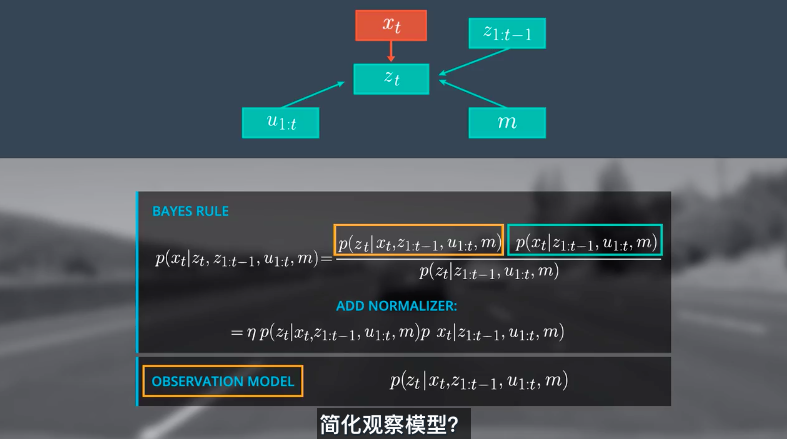

- 使用马尔可夫假设，简化观察模型

  > 使用马尔可夫假设，简化后的观察模型仅仅依赖xt和m。
  >
  > 同时，假设各个观测之间是相互独立的，则呢一写成概率相乘的形式。

  

- 整合

  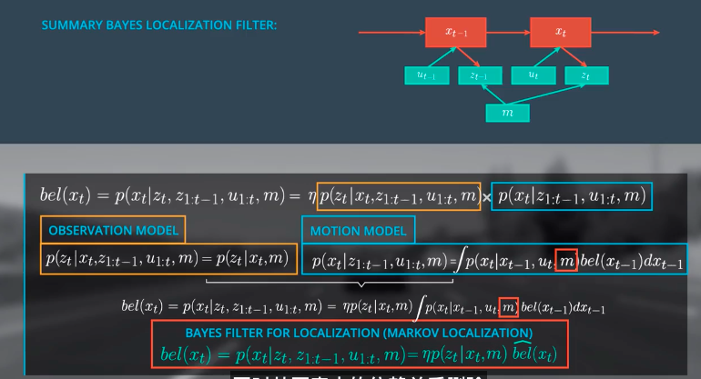

- 观察模型概率计算

  > zt表示绿色的车检测到树和路灯的距离。
  >
  > zt*表示黄色的车在地图上到树和路灯的距离。
  >
  > 观察可以对比看出，车的位置应该在40的位置，而不是在20的位置。

  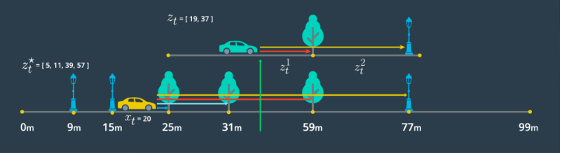

- 观测模型的实现流程

  1. 测量在100米范围内，车辆前进的方向的地标到车距离，zt。
  2. 计算在地图上，地标的位置减去车的当前位置，获得伪距离，zt*，注意使用升序排列。
  3. 配对伪距离和最近的测量距离，比如上图中19和5。
  4. 使用`norm_pdf(observation_measurement, pseudo_range_estimate, observation_stdev) 计算每一个配对点概率值`。
  5. 返回概率的乘积。

- 下面是代码实现

  1. 计算为距离范围计算代码，返回为距离向量

     ```c++
     #include <iostream>
     #include <algorithm>
     #include <vector>

     #include "helpers.h"
     using namespace std;

     //set standard deviation of control:
     float control_stdev = 1.0f;

     //meters vehicle moves per time step
     float movement_per_timestep = 1.0f;

     //number of x positions on map
     int map_size = 25;

     //define landmarks
     std::vector<float> landmark_positions {5, 10, 12, 20};

     std::vector<float> pseudo_range_estimator(std::vector<float> landmark_positions, float pseudo_position);
     ```


      int main() {        
          // step through each pseudo position x (i)
          for (unsigned int i = 0; i < map_size; ++i) {
              float pseudo_position = float(i);
              // get pseudo ranges
              std::vector<float> pseudo_ranges = pseudo_range_estimator(landmark_positions, pseudo_position);
    
              //print to stdout
              if (pseudo_ranges.size() >0) {
                  for (unsigned int s = 0; s < pseudo_ranges.size(); ++s) {
                      std::cout << "x: " << i << "\t" << pseudo_ranges[s] << endl;
                  }
                  std::cout << "-----------------------" << endl;
              }   
          } 
    
          return 0;
      };
    
      std::vector<float> pseudo_range_estimator(std::vector<float> landmark_positions, float pseudo_position) {
          
          //define pseudo observation vector:
          std::vector<float> pseudo_ranges;
                  
          //loop over number of landmarks and estimate pseudo ranges:
          for (unsigned int l=0; l< landmark_positions.size(); ++l) {
              float range_l = landmark_positions[l] - pseudo_position;
              if (range_l > 0.0f) {
                  pseudo_ranges.push_back(range_l);
              }
          }
    
          //sort pseudo range vector:
          sort(pseudo_ranges.begin(), pseudo_ranges.end());
          
          return pseudo_ranges;
      }
     ```


  2. 观察模型

     ```c++
     //observation model: calculates likelihood prob term based on landmark proximity
     float observation_model(std::vector<float> landmark_positions, std::vector<float> observations, 
                             std::vector<float> pseudo_ranges, float distance_max,
                             float observation_stdev) {

         //initialize observation probability:
         float distance_prob = 1.0f;

         //run over current observation vector:
         for (unsigned int z=0; z< observations.size(); ++z) {

             //define min distance:
             float pseudo_range_min;
             
             //check, if distance vector exists:
             if(pseudo_ranges.size() > 0) {
                 //set min distance:
                 pseudo_range_min = pseudo_ranges[0];
                 //remove this entry from pseudo_ranges-vector:
                 pseudo_ranges.erase(pseudo_ranges.begin());

             }    

         //no or negative distances: set min distance to a large number:
         else {

             pseudo_range_min = std::numeric_limits<const float>::infinity();

         }

             //estimate the probabiity for observation model, this is our likelihood: 
             distance_prob *= Helpers::normpdf(observations[z], pseudo_range_min,
                                               observation_stdev);
            
         }
         return distance_prob;
     }
     ```

  3. 整合实现代码

     ```c++
     #include <iostream>
     #include <algorithm>
     #include <vector>
     #include "helpers.h"

     using namespace std;
     std::vector<float> initialize_priors(int map_size, std::vector<float> landmark_positions,
                                           float position_stdev);

     float motion_model(float pseudo_position, float movement, std::vector<float> priors,
                         int map_size, int control_stdev);

      //function to get pseudo ranges
     std::vector<float> pseudo_range_estimator(std::vector<float> landmark_positions, 
                                                float pseudo_position);

      //observation model: calculates likelihood prob term based on landmark proximity
      float observation_model(std::vector<float> landmark_positions, std::vector<float> observations, std::vector<float> pseudo_ranges, float distance_max, float observation_stdev);
     ```


      int main() {  

          //set standard deviation of control:
          float control_stdev = 1.0f;
          
          //set standard deviation of position:
          float position_stdev = 1.0f;
    
          //meters vehicle moves per time step
          float movement_per_timestep = 1.0f;
    
          //set observation standard deviation:
          float observation_stdev = 1.0f;
    
          //number of x positions on map
          int map_size = 25;
    
          //set distance max
          float distance_max = map_size;
    
          //define landmarks
          std::vector<float> landmark_positions {3, 9, 14, 23};
    
          //define observations vector, each inner vector represents a set of observations
          //for a time step
          std::vector<std::vector<float> > sensor_obs {{1,7,12,21}, {0,6,11,20}, {5,10,19}, {4,9,18},
                                          {3,8,17}, {2,7,16}, {1,6,15}, {0,5,14}, {4,13},
                                          {3,12},{2,11},{1,10},{0,9},{8},{7},{6},{5},{4},{3},{2},{1},{0}, 
                                          {}, {}, {}};


          // initialize priors
          std::vector<float> priors = initialize_priors(map_size, landmark_positions,
                                                        position_stdev);
          //initialize posteriors
          std::vector<float> posteriors(map_size, 0.0);
    
          //specify time steps
          int time_steps = sensor_obs.size();
          
          //declare observations vector
          std::vector<float> observations;
          
          //cycle through time steps
          for (unsigned int t = 0; t < time_steps; t++){
              if (!sensor_obs[t].empty()) {
                  observations = sensor_obs[t]; 
             } else {
                  observations = {float(distance_max)};
             }
    
              //step through each pseudo position x (i)
              for (unsigned int i = 0; i < map_size; ++i) {
                  float pseudo_position = float(i);
    
                  //get the motion model probability for each x position
                  float motion_prob = motion_model(pseudo_position, movement_per_timestep,
                                  priors, map_size, control_stdev);
    
                  //get pseudo ranges
                  std::vector<float> pseudo_ranges = pseudo_range_estimator(landmark_positions, 
                                                                        pseudo_position);
    
                  //get observation probability


                  float observation_prob = observation_model(landmark_positions, observations, 
                                                         pseudo_ranges, distance_max, 
                                                         observation_stdev);
                  
                  //calculate the ith posterior
                  posteriors[i] = motion_prob * observation_prob;
              } 
              //normalize
              posteriors = Helpers::normalize_vector(posteriors);
              //update
              priors = posteriors;
         
              for (unsigned int p = 0; p < posteriors.size(); p++) {
                      std::cout << posteriors[p] << endl;  
                  } 
              }
    
          return 0;
      };
    
      //observation model: calculates likelihood prob term based on landmark proximity
      float observation_model(std::vector<float> landmark_positions, std::vector<float> observations, 
                              std::vector<float> pseudo_ranges, float distance_max,
                              float observation_stdev) {
    
          //initialize observation probability:
          float distance_prob = 1.0f;
    
          //run over current observation vector:
          for (unsigned int z=0; z< observations.size(); ++z) {
    
              //define min distance:
              float pseudo_range_min;
              
              //check, if distance vector exists:
              if(pseudo_ranges.size() > 0) {
                  //set min distance:
                  pseudo_range_min = pseudo_ranges[0];
                  //remove this entry from pseudo_ranges-vector:
                  pseudo_ranges.erase(pseudo_ranges.begin());
    
              }    
    
          //no or negative distances: set min distance to a large number:
          else {
    
              pseudo_range_min = std::numeric_limits<const float>::infinity();
    
          }
              //estimate the probabiity for observation model, this is our likelihood: 
              distance_prob *= Helpers::normpdf(observations[z], pseudo_range_min,
                                                observation_stdev);
          }
          return distance_prob;
      }
    
      std::vector<float> pseudo_range_estimator(std::vector<float> landmark_positions,
                                                float pseudo_position) {
          
          //define pseudo observation vector:
          std::vector<float> pseudo_ranges;
                  
          //loop over number of landmarks and estimate pseudo ranges:
              for (unsigned int l=0; l< landmark_positions.size(); ++l) {
    
                  //estimate pseudo range for each single landmark 
                  //and the current state position pose_i:
                  float range_l = landmark_positions[l] - pseudo_position;
                  
                  //check if distances are positive: 
                  if (range_l > 0.0f) {
                      pseudo_ranges.push_back(range_l);
                  }
              }
    
          //sort pseudo range vector:
          sort(pseudo_ranges.begin(), pseudo_ranges.end());
          
          return pseudo_ranges;
      }
    
      //motion model: calculates prob of being at an estimated position at time t
      float motion_model(float pseudo_position, float movement, std::vector<float> priors,
                         int map_size, int control_stdev) {
    
          //initialize probability
          float position_prob = 0.0f;
    
          //step over state space for all possible positions x (convolution):
          for (unsigned int j=0; j< map_size; ++j) {
              float next_pseudo_position = float(j);
              
              //distance from i to j
              float distance_ij = pseudo_position-next_pseudo_position;
    
              //transition probabilities:
              float transition_prob = Helpers::normpdf(distance_ij, movement, 
                                  control_stdev);
              
              //estimate probability for the motion model, this is our prior
              position_prob += transition_prob*priors[j];
          }
          return position_prob;
      }
    
      //initialize priors assumimg vehicle at landmark +/- 1.0 meters position stdev
      std::vector<float> initialize_priors(int map_size, std::vector<float> landmark_positions,
                                           float position_stdev) {
      //initialize priors assumimg vehicle at landmark +/- 1.0 meters position stdev
    
          //set all priors to 0.0
          std::vector<float> priors(map_size, 0.0);
    
          //set each landmark positon +/1 to 1.0/9.0 (9 possible postions)
          float normalization_term = landmark_positions.size() * (position_stdev * 2 + 1);
          for (unsigned int i = 0; i < landmark_positions.size(); i++){
              int landmark_center = landmark_positions[i];
              priors[landmark_center] = 1.0f/normalization_term;
              priors[landmark_center - 1] = 1.0f/normalization_term;
              priors[landmark_center + 1] = 1.0f/normalization_term;
    
          }
          return priors;
      }
     ```


## 3. 运动模型

- 自行车模型

  > 不考虑车辆在垂直方向上的运动，只考虑车辆在二维平面的运动，因为测量的前后轮是联动的，所以前轮和后轮可以分别简化为一个轮子的运动。

  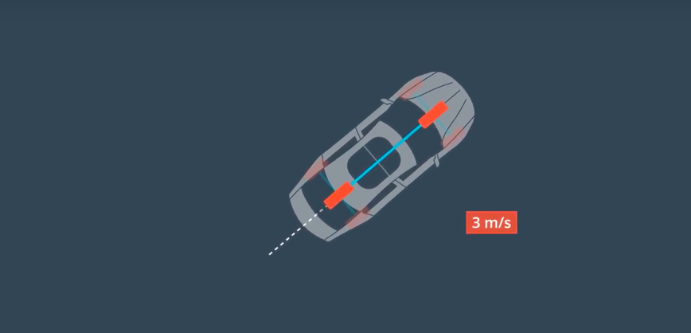

- 角速度和速率

  > 这是之前在传感器融合部分的CTRV模型，当角速度和0和不为0的时候，偏航角和速度的更新过程。

  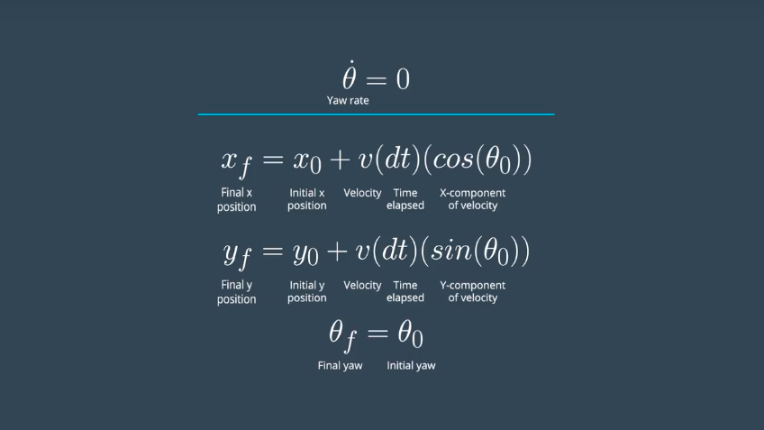   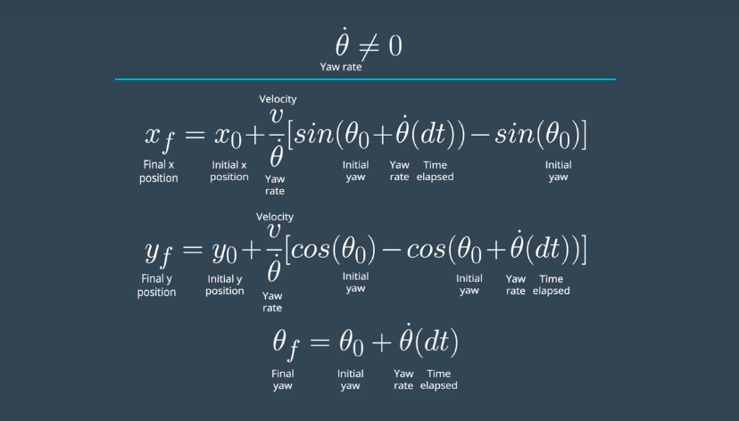

- 定位 VS 传感器融合

  ​	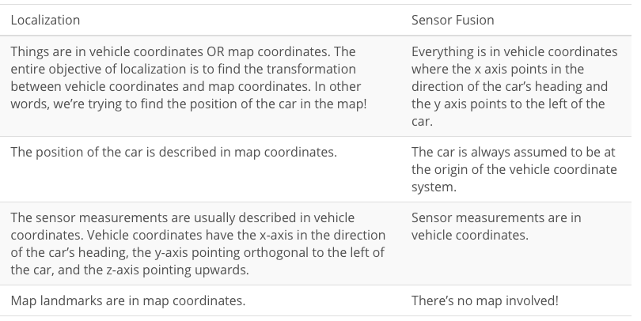

- Roll Pitch 和Yaw

  >  Yaw:绕z轴的旋转角度。
  >
  > Roll:绕x轴的旋转角度。
  >
  > Pitch:绕y轴的旋转角度。
  >
  > 注意：如果是比较平的地方，我们只考虑Yaw就可以了，在一些比较陡峭的地方我们需要考虑Roll和Pitch。

- Odometry

  > 使用轮子上的传感器，测量轮胎旋转的圈数。从而确定车辆的行驶距离。
  >
  > **注意：在路面潮湿和凹凸不平的路面进行行驶的时候，会有误差。但是在弯道行驶不会影响距离的测量。**

  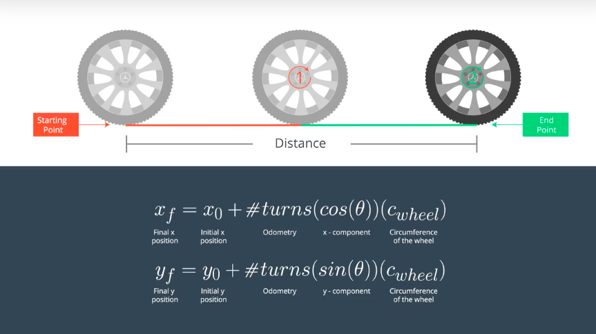


## 4. 粒子滤波

- 直方图滤波，卡尔曼滤波和粒子滤波的对比

  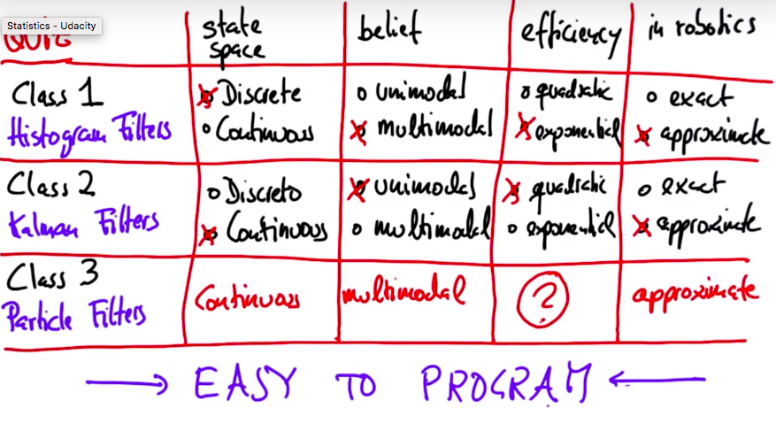

- 机器人世界

  


- 随机生成1000个粒子向量

  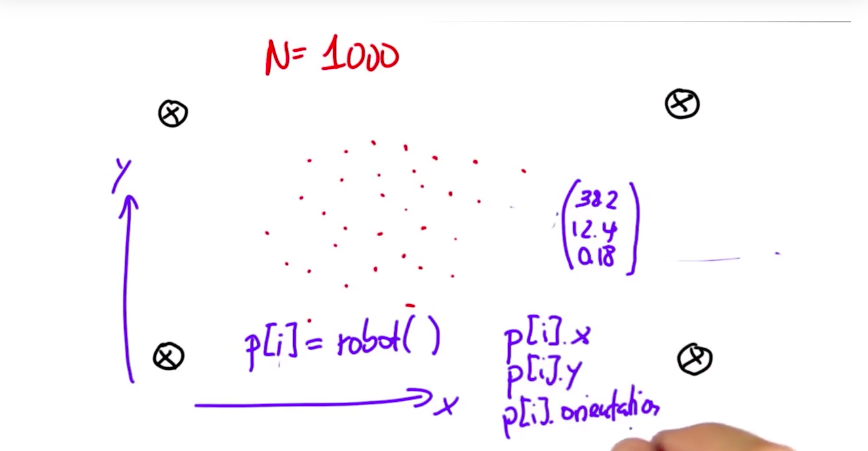示例代码：

  ```python
  N = 1000
  p = []

  #enter code here
  for i in range(1000):
      p.append(robot())

  print len(p)
  ```

  遍历每一个粒子向量，方向0.1移动5

  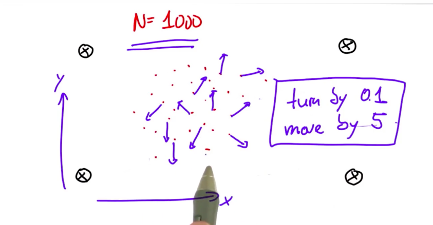示例代码：

  ```python
  for i in range(N):
      x = p[i]
      p[i] =  x.move(0.1, 5)
  ```

- 给每一个粒子设置一个权重（重采样，很重要）

  > 中间的蓝点色圆圈表示机器人所在的位置，红色圆圈表示粒子在的位置的权重大小，越大表示权重越大，越小，权重越小。

  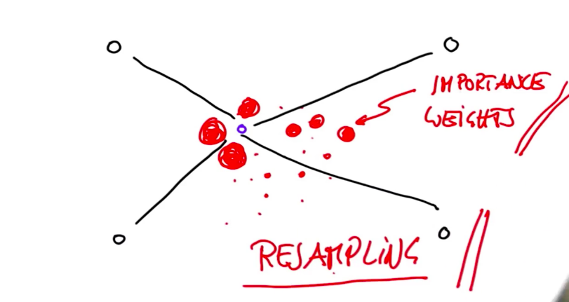

  > 权重的计算方式：根据机器人的测量值和粒子的值进行对比，匹配程度越高的权重越大，匹配度越小的概率越小。
  >
  > 重采样：根据计算出的每一个粒子的概率，重新取样替换粒子列表数据，权重大的粒子可能会重复取到，权重小的粒子可能被淘汰掉。

  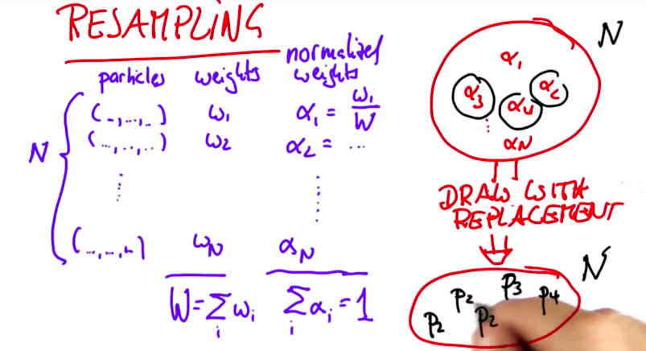

  > 重采样轮子，重采样的算法

  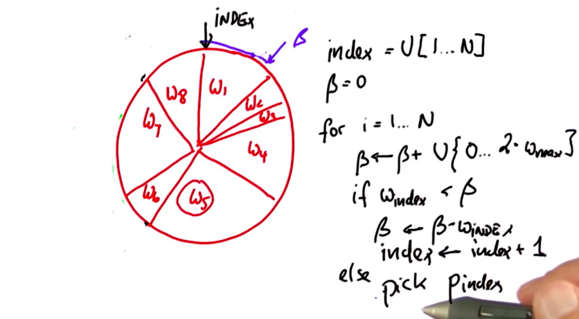

  > 数学定义

  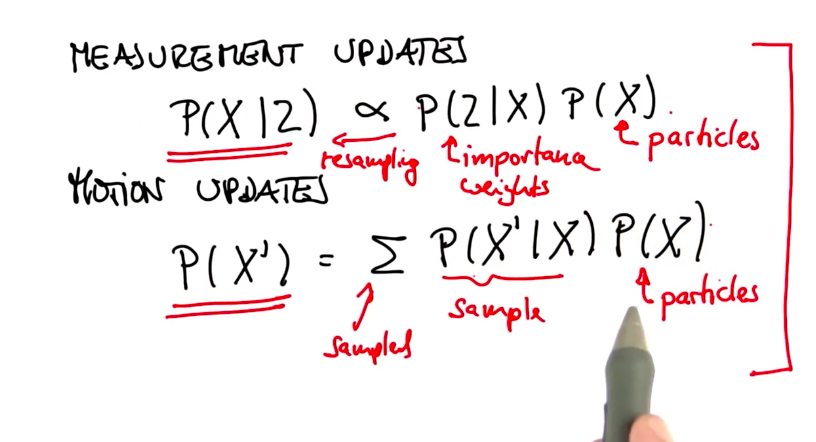

  代码

  ```python
  # Please only modify the indicated area below!

  from math import *
  import random

  landmarks  = [[20.0, 20.0], [80.0, 80.0], [20.0, 80.0], [80.0, 20.0]]
  world_size = 100.0

  class robot:
      def __init__(self):
          self.x = random.random() * world_size
          self.y = random.random() * world_size
          self.orientation = random.random() * 2.0 * pi
          self.forward_noise = 0.0;
          self.turn_noise    = 0.0;
          self.sense_noise   = 0.0;
      
      def set(self, new_x, new_y, new_orientation):
          if new_x < 0 or new_x >= world_size:
              raise ValueError, 'X coordinate out of bound'
          if new_y < 0 or new_y >= world_size:
              raise ValueError, 'Y coordinate out of bound'
          if new_orientation < 0 or new_orientation >= 2 * pi:
              raise ValueError, 'Orientation must be in [0..2pi]'
          self.x = float(new_x)
          self.y = float(new_y)
          self.orientation = float(new_orientation)
      
      
      def set_noise(self, new_f_noise, new_t_noise, new_s_noise):
          # makes it possible to change the noise parameters
          # this is often useful in particle filters
          self.forward_noise = float(new_f_noise);
          self.turn_noise    = float(new_t_noise);
          self.sense_noise   = float(new_s_noise);
      
      
      def sense(self):
          Z = []
          for i in range(len(landmarks)):
              dist = sqrt((self.x - landmarks[i][0]) ** 2 + (self.y - landmarks[i][1]) ** 2)
              dist += random.gauss(0.0, self.sense_noise)
              Z.append(dist)
          return Z
      
      
      def move(self, turn, forward):
          if forward < 0:
              raise ValueError, 'Robot cant move backwards'         
          
          # turn, and add randomness to the turning command
          orientation = self.orientation + float(turn) + random.gauss(0.0, self.turn_noise)
          orientation %= 2 * pi
          
          # move, and add randomness to the motion command
          dist = float(forward) + random.gauss(0.0, self.forward_noise)
          x = self.x + (cos(orientation) * dist)
          y = self.y + (sin(orientation) * dist)
          x %= world_size    # cyclic truncate
          y %= world_size
          
          # set particle
          res = robot()
          res.set(x, y, orientation)
          res.set_noise(self.forward_noise, self.turn_noise, self.sense_noise)
          return res
      
      def Gaussian(self, mu, sigma, x):
          
          # calculates the probability of x for 1-dim Gaussian with mean mu and var. sigma
          return exp(- ((mu - x) ** 2) / (sigma ** 2) / 2.0) / sqrt(2.0 * pi * (sigma ** 2))
      
      
      def measurement_prob(self, measurement):
          
          # calculates how likely a measurement should be
          
          prob = 1.0;
          for i in range(len(landmarks)):
              dist = sqrt((self.x - landmarks[i][0]) ** 2 + (self.y - landmarks[i][1]) ** 2)
              prob *= self.Gaussian(dist, self.sense_noise, measurement[i])
          return prob
        
      def __repr__(self):
          return '[x=%.6s y=%.6s orient=%.6s]' % (str(self.x), str(self.y), str(self.orientation))
      
      def eval(r, p):

        # 粒子的最小均方误差

        sum = 0.0;

        for i in range(len(p)): # calculate mean error

            dx = (p[i].x - r.x + (world_size/2.0)) % world_size - (world_size/2.0)

            dy = (p[i].y - r.y + (world_size/2.0)) % world_size - (world_size/2.0)

            err = sqrt(dx * dx + dy * dy)

            sum += err

        return sum / float(len(p))

     #DON'T MODIFY ANYTHING ABOVE HERE! ENTER/MODIFY CODE BELOW

    myrobot = robot()
    myrobot = myrobot.move(0.1, 5.0)
    Z = myrobot.sense()
    N = 1000
    T = 10 #Leave this as 10 for grading purposes.
    p = []
    for i in range(N):

        r = robot()

        r.set_noise(0.05, 0.05, 5.0)

        p.append(r)

    print eval(myrobot, p)
    for t in range(T):
        myrobot = myrobot.move(0.1, 5.0)
        Z = myrobot.sense()
  p2 = []
    for i in range(N):
        p2.append(p[i].move(0.1, 5.0))
    p = p2

    # 计算权重
    w = []
    for i in range(N):
        w.append(p[i].measurement_prob(Z))

    # 从采样
    p3 = []
    index = int(random.random() * N)
    beta = 0.0
    mw = max(w)
    for i in range(N):
        beta += random.random() * 2.0 * mw
        while beta > w[index]:
            beta -= w[index]
            index = (index + 1) % N
        p3.append(p[index])
    p = p3
    # 评估粒子滤波
    print eval(myrobot, p)
  ```


  

- 实现粒子滤波

  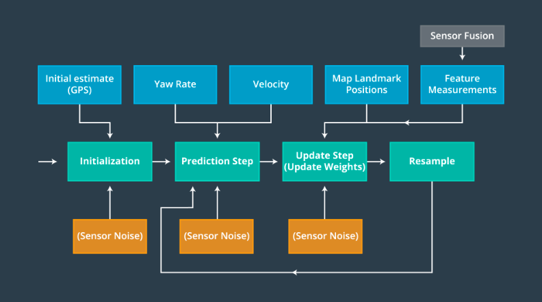

  >  使用GPS初始化概率分布

  ```C++
  /*
     * print_samples_sol.cpp
     *
     * SOLUTION CODE
     * 
     * Print out to the terminal 3 samples from a normal distribution with
     * mean equal to the GPS position and IMU heading measurements and
     * standard deviation of 2 m for the x and y position and 0.05 radians
     * for the heading of the car. 
     *
     * Author: Tiffany Huang
     */

    #include <random> // Need this for sampling from distributions
    #include <iostream>

    using namespace std;

    // @param gps_x 	GPS provided x position
    // @param gps_y 	GPS provided y position
    // @param theta		GPS provided yaw
    void printSamples(double gps_x, double gps_y, double theta) {
    	default_random_engine gen;
    	double std_x, std_y, std_theta; // Standard deviations for x, y, and theta

    	// TODO: Set standard deviations for x, y, and theta
    	 std_x = 2;
    	 std_y = 2;
    	 std_theta = 0.05;
    	 

    	// This line creates a normal (Gaussian) distribution for x
    	normal_distribution<double> dist_x(gps_x, std_x);
    	
    	// TODO: Create normal distributions for y and theta
    	normal_distribution<double> dist_y(gps_y, std_y);
    	normal_distribution<double> dist_theta(theta, std_theta);

    	
    	for (int i = 0; i < 3; ++i) {
    		double sample_x, sample_y, sample_theta;
    		
    		// TODO: Sample  and from these normal distrubtions like this: 
    		//	 sample_x = dist_x(gen);
    		//	 where "gen" is the random engine initialized earlier.
    		
    		 sample_x = dist_x(gen);
    		 sample_y = dist_y(gen);
    		 sample_theta = dist_theta(gen);	 
    		 
    		 // Print your samples to the terminal.
    		 cout << "Sample " << i + 1 << " " << sample_x << " " << sample_y << " " << sample_theta << endl;
    	}

    }

    int main() {
    	
    	// Set GPS provided state of the car.
    	double gps_x = 4983;
    	double gps_y = 5029;
    	double theta = 1.201;
    	
    	// Sample from the GPS provided position.
    	printSamples(gps_x, gps_y, theta);
    	
    	return 0;
    }  
  ```


- 预测，和之前使用的预测模型一致

  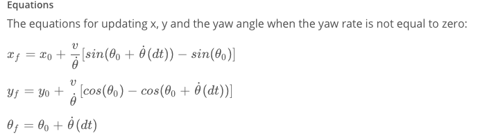

  ​

- 根据地标和车辆的测量数据，更新车辆的当前位置

  > 图中，蓝色表示地图的位置，橙色表示激光雷达的测量值，可以看到激光雷达有多个测量值，最简单的方法是通过最近邻法去判断测量值和地标的对应关系。

  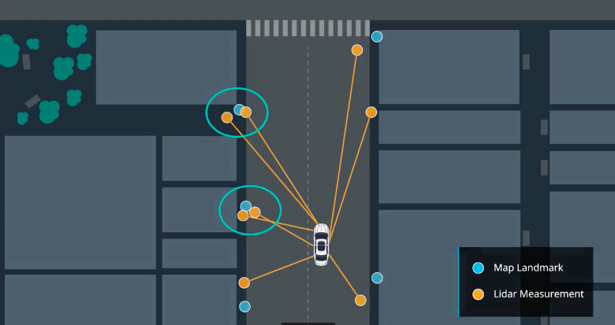

  最邻近法判断关联的优缺点对比：

  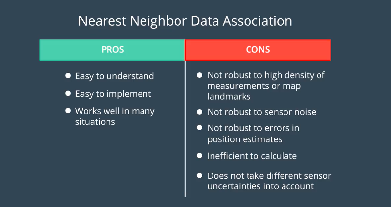

  权重计算公式，使用多元高斯分布：

  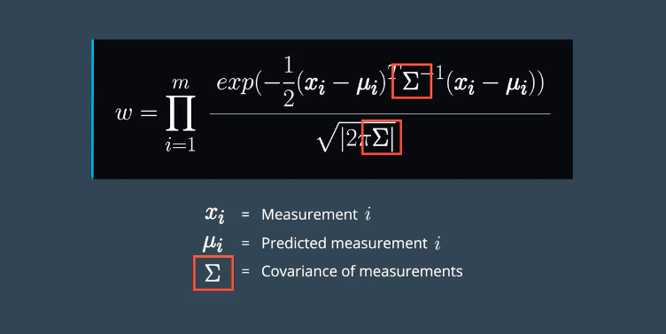

- 计算预测误差：

  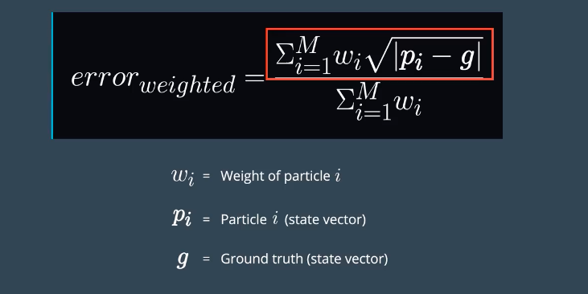

- 把观察数据转换为地图坐标

  > 从车辆坐标系统到地图坐标系统
  >
  > 其中Car表车辆的真实所在位置OBS1,OBS2,OBS3表示其观测值，L1,L2,L3,L4,L5表示地标所在的位置。
  >
  > 由于我们测量的时候是在车辆前行的方向测量的，那么粒子也需要在其前进的方向去查找地标。所以需要把测量距离加到粒子前进方向一致的位置。所以需要进行坐标转换。
  >
  > **注意：我们需要转换的是粒子的观察坐标到map上 **

  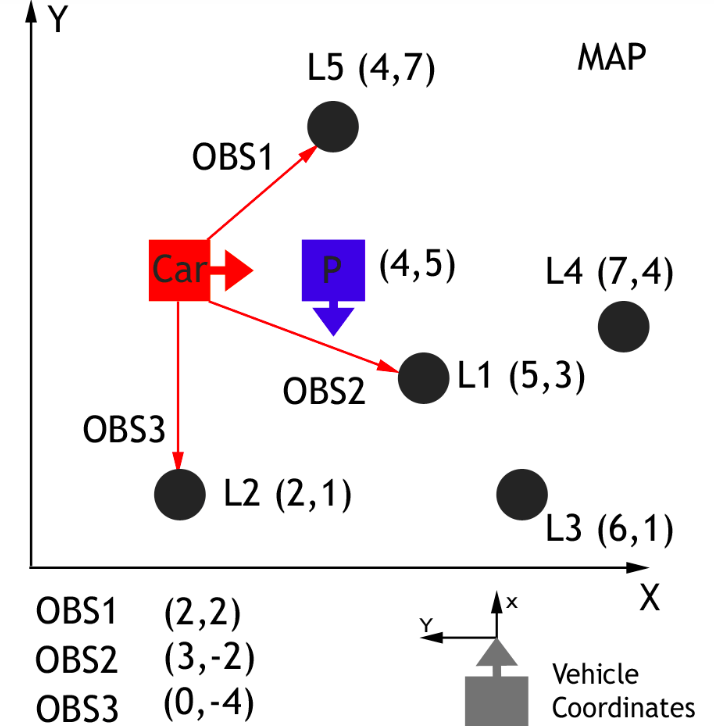

  > 转换公式：
  >
  > [引用文章1](http://farside.ph.utexas.edu/teaching/336k/Newtonhtml/node153.html)
  >
  > [引用文章2](https://www.miniphysics.com/coordinate-transformation-under-rotation.html)

  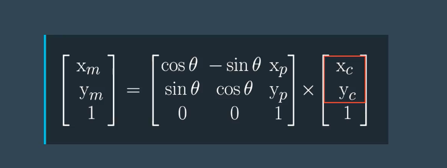

  > 代码示例：

  ```python
  import numpy as np

  # define coordinates and theta
  x_part= 4
  y_part= 5
  x_obs= 2
  y_obs= 2
  theta= -np.pi/2 # -90 degrees

  # transform to map x coordinate
  x_map= x_part + (np.cos(theta) * x_obs) - (np.sin(theta) * y_obs)

  # transform to map y coordinate
  y_map= y_part + (np.sin(theta) * x_obs) + (np.cos(theta) * y_obs)

  print(int(x_map), int(y_map)) # (6,3)
  ```

  ​

- 联合

  使用最近邻法计算即可，最简单的就是计算欧式距。

- 计算粒子滤波的权重

  > 使用多元高斯计算概率值。
  >
  > 其中，ux和uy表示地标的坐标，x,y表示观测值的坐标。

  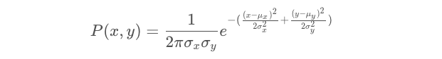

  > 代码示例：

  ```python
  import math

  # define inputs
  sig_x= 0.3
  sig_y= 0.3
  x_obs= 6
  y_obs= 3
  mu_x= 5
  mu_y= 3

  # calculate normalization term
  gauss_norm= (1/(2 * np.pi * sig_x * sig_y))

  # calculate exponent
  exponent= ((x_obs - mu_x)**2)/(2 * sig_x**2) + ((y_obs - mu_y)**2)/(2 * sig_y**2)

  # calculate weight using normalization terms and exponent
  weight= gauss_norm * math.exp(-exponent)

  print(weight) # should be around 0.00683644777551 rounding to 6.84E-3
  ```

  > 粒子滤波的权重为当前粒子的所有观察值概率乘积

- 最终项目核心代码

  ```c++
  /*
   * particle_filter.cpp
   *
   *  Created on: Dec 12, 2016
   *      Author: Tiffany Huang
   */

  #include "particle_filter.h"

  #include <algorithm>
  #include <cmath>
  #include <iostream>
  #include <iterator>
  #include <random>
  #include <string>
  #include <vector>

  #include "map.h"

  using namespace std;

  // 根据初始位置，初始化粒子滤波器
  void ParticleFilter::init(double x, double y, double theta, double std[]) {
    // 在原GPS值上，加上高斯噪声
    normal_distribution<double> norm_x(x, std[0]);
    normal_distribution<double> norm_y(y, std[1]);
    normal_distribution<double> norm_theta(theta, std[2]);
    default_random_engine generator;

    // 设置总共粒子的数量为100，把生成的粒子放到列表
    num_particles = 100;
    particles.resize(num_particles);
    for (auto& p : particles) {
      p.x = norm_x(generator);
      p.y = norm_y(generator);
      p.theta = norm_theta(generator);
      p.weight = 1.0;
      weights.push_back(1.0);
    }

    // 设置所有粒子已经初始化完成
    is_initialized = true;
  }

  void ParticleFilter::prediction(double delta_t, double std_pos[], double velocity, double yaw_rate) {
    // TODO: Add measurements to each particle and add random Gaussian noise.
    // NOTE: When adding noise you may find std::normal_distribution and std::default_random_engine useful.
    //  http://en.cppreference.com/w/cpp/numeric/random/normal_distribution
    //  http://www.cplusplus.com/reference/random/default_random_engine/

    default_random_engine generator;
    normal_distribution<double> norm_x(0, std_pos[0]);
    normal_distribution<double> norm_y(0, std_pos[1]);
    normal_distribution<double> norm_theta(0, std_pos[2]);
    // 根据上一时刻的状态，预测下一时刻的状态
    for (auto & p : particles) {
      if (fabs(yaw_rate) > 0.001) {
        p.x += velocity / yaw_rate * (sin(p.theta + yaw_rate * delta_t) - sin(p.theta));
        p.y += velocity / yaw_rate * (cos(p.theta) - cos(p.theta + yaw_rate * delta_t));
        p.theta += yaw_rate * delta_t;
      } else {
        p.x += velocity * delta_t * cos(p.theta);
        p.y += velocity * delta_t * sin(p.theta);
      }

      // 加上高斯噪声
      p.x += norm_x(generator);
      p.y += norm_y(generator);
      p.theta += norm_theta(generator);
    }
  }

  /**
   * 数据联合（预测点和测量点）
   **/
  void ParticleFilter::dataAssociation(std::vector<LandmarkObs> predicted, std::vector<LandmarkObs>& observations) {
    // TODO: Find the predicted measurement that is closest to each observed measurement and assign the
    //   observed measurement to this particular landmark.
    // NOTE: this method will NOT be called by the grading code. But you will probably find it useful to
    //   implement this method and use it as a helper during the updateWeights phase.

    // 遍历每一个测量点，把它归属于最近的地标点
    for (auto & obs : observations) {
      double mindist = std::numeric_limits<float>::max();
      for (auto & pre : predicted) {
        double result = dist(obs.x, obs.y, pre.x, pre.y);
        if (result < mindist) {
          mindist = result;
          obs.id = pre.id;
        }
      }
    }
  }

  /**
   * 使用多元高斯更新权重
   **/
  void ParticleFilter::updateWeights(double sensor_range, double std_landmark[], const std::vector<LandmarkObs> &observations,
                                     const Map &map_landmarks) {
    // TODO: Update the weights of each particle using a mult-variate Gaussian distribution. You can read
    //   more about this distribution here: https://en.wikipedia.org/wiki/Multivariate_normal_distribution
    // NOTE: The observations are given in the VEHICLE'S coordinate system. Your particles are located
    //   according to the MAP'S coordinate system. You will need to transform between the two systems.
    //   Keep in mind that this transformation requires both rotation AND translation (but no scaling).
    //   The following is a good resource for the theory:
    //   https://www.willamette.edu/~gorr/classes/GeneralGraphics/Transforms/transforms2d.htm
    //   and the following is a good resource for the actual equation to implement (look at equation
    //   3.33
    //   http://planning.cs.uiuc.edu/node99.html

    for (auto & p : particles) {

      // 计算当前粒子sensor_range范围内的地标点
      std::vector<LandmarkObs> predicted;
      for (const auto& lm : map_landmarks.landmark_list) {
        double result = dist(p.x, p.y, lm.x_f, lm.y_f);
        if (result < sensor_range) {
          LandmarkObs markObs = LandmarkObs { lm.id_i, lm.x_f, lm.y_f };
          predicted.push_back(markObs);
        }
      }

      // 把测量值坐标转换为地图坐标
      std::vector<LandmarkObs> observationsmap;
      for (const auto & obs : observations) {
        LandmarkObs tmp;
        tmp.x = p.x + cos(p.theta) * obs.x - sin(p.theta) * obs.y;
        tmp.y = p.y + sin(p.theta) * obs.x + cos(p.theta) * obs.y;
        observationsmap.push_back(tmp);
      }

      // 对于每一个观察值，计算地图上最近的地标是哪一个
      dataAssociation(predicted, observationsmap);

      // 对每一个观察值，转换到地图坐标，使用多元高斯计算权重
      p.weight = 1.0;
      for (const auto &obs_m : observationsmap) {
        LandmarkObs landmark;
        for (auto & pre : predicted) {
          if (pre.id == obs_m.id) {
            landmark = pre;
          }
        }
        //Map::single_landmark_s landmark = map_landmarks.landmark_list.at(obs_m.id-1);
        double gauss_norm = 1 / (2 * M_PI * std_landmark[0] * std_landmark[1]);
        double exponent = pow(obs_m.x - landmark.x, 2) / (2 * pow(std_landmark[0], 2))
                        + pow(obs_m.y - landmark.y, 2) / (2 * pow(std_landmark[1], 2));
        p.weight *= gauss_norm * exp(-exponent);
      }
      weights.push_back(p.weight);
    }
  }

  /**
   *根据权重，重采样
   **/
  void ParticleFilter::resample() {
    // TODO: Resample particles with replacement with probability proportional to their weight.
    // NOTE: You may find std::discrete_distribution helpful here.
    //   http://en.cppreference.com/w/cpp/numeric/random/discrete_distribution

    // 把粒子滤波的权重建立一个权重数组
    int particles_size = particles.size();
    vector<double> weights;
    for (int i = 0; i < particles_size; i++) {
      Particle particle = particles[i];
      weights.push_back(particle.weight);
    }

    // 根据新建的权重数组，进行重采样,
    // discrete_distribution会根据其中每个粒权重定义为wi/S，即第i个粒子的权重除以所有n个权重之和
    discrete_distribution<> d(weights.begin(), weights.end());
    default_random_engine generator;
    std::vector<Particle> new_particles;
    for (int i = 0; i < particles_size; i++) {
      int index = d(generator);
      new_particles.push_back(particles[index]);
    }
    particles = new_particles;
    weights.clear();
  }

  Particle ParticleFilter::SetAssociations(Particle& particle, const std::vector<int>& associations,
                                           const std::vector<double>& sense_x, const std::vector<double>& sense_y) {
    //particle: the particle to assign each listed association, and association's (x,y) world coordinates mapping to
    // associations: The landmark id that goes along with each listed association
    // sense_x: the associations x mapping already converted to world coordinates
    // sense_y: the associations y mapping already converted to world coordinates

    particle.associations = associations;
    particle.sense_x = sense_x;
    particle.sense_y = sense_y;

    return particle;
  }

  string ParticleFilter::getAssociations(Particle best) {
    vector<int> v = best.associations;
    stringstream ss;
    copy(v.begin(), v.end(), ostream_iterator<int>(ss, " "));
    string s = ss.str();
    s = s.substr(0, s.length() - 1);  // get rid of the trailing space

    return s;
  }
  string ParticleFilter::getSenseX(Particle best) {
    vector<double> v = best.sense_x;
    stringstream ss;
    copy(v.begin(), v.end(), ostream_iterator<float>(ss, " "));
    string s = ss.str();
    s = s.substr(0, s.length() - 1);  // get rid of the trailing space

    return s;
  }
  string ParticleFilter::getSenseY(Particle best) {
    vector<double> v = best.sense_y;
    stringstream ss;
    copy(v.begin(), v.end(), ostream_iterator<float>(ss, " "));
    string s = ss.str();
    s = s.substr(0, s.length() - 1);  // get rid of the trailing space

    return s;
  }

  ```

  ​

  ​

  ​


